```mermaid
erDiagram
    Users {
        ObjectId _id PK
        String name
        String email UK
        String password
        String phone
        Date birthDate
        String role
        Boolean isActive
        Boolean isVerified
        String avatar
        Array concerns
        String preferredMethod
        String preferredGender
        String additionalInfo
        Boolean marketingConsent
        Date createdAt
        Date updatedAt
    }

    Counselors {
        ObjectId _id PK
        ObjectId user FK
        String license
        String licenseNumber
        String university
        Number experience
        String careerDetails
        Array specialties
        Number fee
        Array methods
        String introduction
        String licenseFile
        String resumeFile
        String status
        Date approvedAt
        ObjectId approvedBy FK
        String rejectionReason
        Object rating
        Object stats
        Object availability
        Boolean isActive
        Date createdAt
        Date updatedAt
    }

    Bookings {
        ObjectId _id PK
        ObjectId client FK
        ObjectId counselor FK
        Date date
        String startTime
        String endTime
        Number duration
        String method
        String topic
        String notes
        Number fee
        String paymentStatus
        String paymentId
        Date paidAt
        String status
        ObjectId cancelledBy FK
        Date cancelledAt
        String cancellationReason
        String sessionId UK
        Date sessionStartedAt
        Date sessionEndedAt
        Number actualDuration
        Boolean reminderSent
        Date reminderSentAt
        Date createdAt
        Date updatedAt
    }

    Reviews {
        ObjectId _id PK
        ObjectId booking FK
        ObjectId client FK
        ObjectId counselor FK
        Number rating
        String comment
        Object ratings
        Boolean wouldRecommend
        Boolean isAnonymous
        String status
        ObjectId reviewedBy FK
        Date reviewedAt
        String rejectionReason
        Number helpfulVotes
        Date createdAt
        Date updatedAt
    }

    ChatMessages {
        ObjectId _id PK
        ObjectId booking FK
        ObjectId sender FK
        String message
        String messageType
        String fileName
        String fileUrl
        Number fileSize
        Boolean isRead
        Date readAt
        Date createdAt
    }

    Notifications {
        ObjectId _id PK
        ObjectId user FK
        String title
        String message
        String type
        ObjectId relatedId
        String relatedType
        Boolean isRead
        Date readAt
        Array channels
        Date sentAt
        Date createdAt
    }

    Payments {
        ObjectId _id PK
        ObjectId booking FK
        ObjectId user FK
        ObjectId counselor FK
        Number amount
        String currency
        String paymentMethod
        String paymentGateway
        String transactionId UK
        Object gatewayResponse
        String status
        Number platformFee
        Number counselorAmount
        Number refundAmount
        String refundReason
        Date refundedAt
        ObjectId refundedBy FK
        Date completedAt
        String failureReason
        Date failedAt
        Date createdAt
        Date updatedAt
    }

    %% 관계 ì •ì˜
    Users ||--o{ Counselors : "has profile"
    Users ||--o{ Bookings : "books as client"
    Counselors ||--o{ Bookings : "provides service"
    Users ||--o{ Reviews : "writes"
    Counselors ||--o{ Reviews : "receives"
    Bookings ||--o| Reviews : "has review"
    Bookings ||--o{ ChatMessages : "contains messages"
    Users ||--o{ ChatMessages : "sends"
    Users ||--o{ Notifications : "receives"
    Bookings ||--o{ Payments : "has payments"
    Users ||--o{ Payments : "makes payment"
    Counselors ||--o{ Payments : "receives payment"
```

# 마인드버디 데이터베이스 ERD

## 📊 Entity Relationship Diagram

### 1. 핵심 엔티티 개요

```
Users (사용자)
├── Counselors (상담사 프로필)
├── Bookings (예약)
├── Reviews (리뷰)
└── Sessions (세션 로그)
```

### 2. 상세 엔티티 구조

#### 🧑‍💼 Users (사용자)
```
Users {
  _id: ObjectId (PK)
  name: String (required)
  email: String (unique, required)
  password: String (hashed, required)
  phone: String (required)
  birthDate: Date
  role: Enum ['client', 'counselor', 'admin']
  isActive: Boolean (default: true)
  isVerified: Boolean (default: false)
  avatar: String (file path)
  
  // 상담자 전용 필드
  concerns: Array<String> ['depression', 'anxiety', 'trauma', ...]
  preferredMethod: Enum ['video', 'voice', 'chat', 'all']
  preferredGender: Enum ['male', 'female', 'any']
  additionalInfo: String (max: 500)
  
  // 마케팅 및 메타데이터
  marketingConsent: Boolean (default: false)
  createdAt: Date (default: now)
  updatedAt: Date (auto-update)
}
```

#### 👨‍⚕️ Counselors (상담사)
```
Counselors {
  _id: ObjectId (PK)
  user: ObjectId (FK -> Users._id, required)
  
  // 자격 및 경력
  license: Enum ['clinical', 'counseling', 'social', 'other'] (required)
  licenseNumber: String (required)
  university: String (required, max: 100)
  experience: Number (min: 0, max: 50, required)
  careerDetails: String (max: 1000)
  
  // 전문 분야
  specialties: Array<String> ['depression', 'anxiety', 'trauma', ...]
  
  // 상담 정보
  fee: Number (min: 10000, max: 500000, required)
  methods: Array<String> ['video', 'voice', 'chat']
  introduction: String (max: 2000, required)
  
  // 서류
  licenseFile: String (file path, required)
  resumeFile: String (file path, required)
  
  // 승인 상태
  status: Enum ['pending', 'approved', 'rejected', 'suspended']
  approvedAt: Date
  approvedBy: ObjectId (FK -> Users._id)
  rejectionReason: String (max: 500)
  
  // 평점 및 통계
  rating: {
    average: Number (0-5, default: 0)
    count: Number (default: 0)
  }
  stats: {
    totalSessions: Number (default: 0)
    completedSessions: Number (default: 0)
    cancelledSessions: Number (default: 0)
    totalEarnings: Number (default: 0)
  }
  
  // 가용성 (요일별 시간)
  availability: {
    monday: Array<{start: String, end: String}>
    tuesday: Array<{start: String, end: String}>
    wednesday: Array<{start: String, end: String}>
    thursday: Array<{start: String, end: String}>
    friday: Array<{start: String, end: String}>
    saturday: Array<{start: String, end: String}>
    sunday: Array<{start: String, end: String}>
  }
  
  isActive: Boolean (default: true)
  createdAt: Date (default: now)
  updatedAt: Date (auto-update)
}
```#### 📅 
Bookings (예약/세션)
```
Bookings {
  _id: ObjectId (PK)
  client: ObjectId (FK -> Users._id, required)
  counselor: ObjectId (FK -> Counselors._id, required)
  
  // 예약 정보
  date: Date (required)
  startTime: String (HH:MM format, required)
  endTime: String (HH:MM format, required)
  duration: Number (minutes, default: 50)
  
  // 상담 방식 및 주제
  method: Enum ['video', 'voice', 'chat'] (required)
  topic: Enum ['depression', 'anxiety', 'trauma', 'relationship', 'family', 'work', 'other']
  notes: String (max: 1000)
  
  // 결제 정보
  fee: Number (required)
  paymentStatus: Enum ['pending', 'paid', 'failed', 'refunded']
  paymentId: String
  paidAt: Date
  
  // 예약 상태
  status: Enum ['pending', 'confirmed', 'in-progress', 'completed', 'cancelled', 'no-show']
  
  // 취소 정보
  cancelledBy: ObjectId (FK -> Users._id)
  cancelledAt: Date
  cancellationReason: String (max: 500)
  
  // 세션 정보
  sessionId: String (unique, UUID)
  sessionStartedAt: Date
  sessionEndedAt: Date
  actualDuration: Number (minutes)
  
  // 리마인더
  reminderSent: Boolean (default: false)
  reminderSentAt: Date
  
  createdAt: Date (default: now)
  updatedAt: Date (auto-update)
}
```

#### ⭐ Reviews (리뷰)
```
Reviews {
  _id: ObjectId (PK)
  booking: ObjectId (FK -> Bookings._id, unique, required)
  client: ObjectId (FK -> Users._id, required)
  counselor: ObjectId (FK -> Counselors._id, required)
  
  // 평점 (1-5)
  rating: Number (min: 1, max: 5, required)
  comment: String (max: 1000)
  
  // 세부 평가 항목
  ratings: {
    professionalism: Number (1-5)
    communication: Number (1-5)
    helpfulness: Number (1-5)
    punctuality: Number (1-5)
  }
  
  // 추천 및 익명 여부
  wouldRecommend: Boolean (default: true)
  isAnonymous: Boolean (default: false)
  
  // 상태 및 검토
  status: Enum ['pending', 'approved', 'rejected'] (default: 'pending')
  reviewedBy: ObjectId (FK -> Users._id)
  reviewedAt: Date
  rejectionReason: String (max: 500)
  
  // 도움이 됨 투표
  helpfulVotes: Number (default: 0)
  
  createdAt: Date (default: now)
  updatedAt: Date (auto-update)
}
```

#### 💬 ChatMessages (채팅 메시지) - 추가 엔티티
```
ChatMessages {
  _id: ObjectId (PK)
  booking: ObjectId (FK -> Bookings._id, required)
  sender: ObjectId (FK -> Users._id, required)
  
  // 메시지 내용
  message: String (max: 1000, required)
  messageType: Enum ['text', 'file', 'system'] (default: 'text')
  
  // 파일 정보 (파일 메시지인 경우)
  fileName: String
  fileUrl: String
  fileSize: Number
  
  // 메시지 상태
  isRead: Boolean (default: false)
  readAt: Date
  
  createdAt: Date (default: now)
}
```#### 
📊 SessionLogs (세션 로그) - 추가 엔티티
```
SessionLogs {
  _id: ObjectId (PK)
  booking: ObjectId (FK -> Bookings._id, required)
  sessionId: String (required)
  
  // 참가자 정보
  participants: Array<{
    user: ObjectId (FK -> Users._id)
    joinedAt: Date
    leftAt: Date
    duration: Number (minutes)
  }>
  
  // 세션 이벤트
  events: Array<{
    type: Enum ['join', 'leave', 'mute', 'unmute', 'video_on', 'video_off', 'screen_share']
    user: ObjectId (FK -> Users._id)
    timestamp: Date
    data: Object (additional event data)
  }>
  
  // 세션 품질 정보
  quality: {
    averageLatency: Number
    connectionIssues: Number
    audioQuality: Number (1-5)
    videoQuality: Number (1-5)
  }
  
  createdAt: Date (default: now)
  updatedAt: Date (auto-update)
}
```

#### 🔔 Notifications (알림) - 추가 엔티티
```
Notifications {
  _id: ObjectId (PK)
  user: ObjectId (FK -> Users._id, required)
  
  // 알림 내용
  title: String (max: 100, required)
  message: String (max: 500, required)
  type: Enum ['booking', 'payment', 'review', 'system', 'reminder']
  
  // 관련 데이터
  relatedId: ObjectId (booking, review 등의 ID)
  relatedType: String ('booking', 'review', etc.)
  
  // 알림 상태
  isRead: Boolean (default: false)
  readAt: Date
  
  // 전송 정보
  channels: Array<String> ['web', 'email', 'sms']
  sentAt: Date
  
  createdAt: Date (default: now)
}
```

#### 💳 Payments (결제) - 추가 엔티티
```
Payments {
  _id: ObjectId (PK)
  booking: ObjectId (FK -> Bookings._id, required)
  user: ObjectId (FK -> Users._id, required)
  counselor: ObjectId (FK -> Counselors._id, required)
  
  // 결제 정보
  amount: Number (required)
  currency: String (default: 'KRW')
  paymentMethod: Enum ['card', 'bank_transfer', 'kakao_pay', 'naver_pay']
  
  // 외부 결제 시스템 정보
  paymentGateway: String ('toss', 'iamport', etc.)
  transactionId: String (unique)
  gatewayResponse: Object
  
  // 결제 상태
  status: Enum ['pending', 'processing', 'completed', 'failed', 'cancelled', 'refunded']
  
  // 수수료 정보
  platformFee: Number (플랫폼 수수료)
  counselorAmount: Number (상담사 수령액)
  
  // 환불 정보
  refundAmount: Number
  refundReason: String
  refundedAt: Date
  
  createdAt: Date (default: now)
  updatedAt: Date (auto-update)
}
```### 3. 관
계 (Relationships)

#### 🔗 주요 관계 정의

```
Users (1) ←→ (0..1) Counselors
- 한 사용자는 최대 하나의 상담사 프로필을 가질 수 있음
- 상담사는 반드시 하나의 사용자 계정과 연결됨

Users (1) ←→ (0..*) Bookings (as client)
- 한 사용자(상담자)는 여러 예약을 가질 수 있음

Counselors (1) ←→ (0..*) Bookings
- 한 상담사는 여러 예약을 가질 수 있음

Bookings (1) ←→ (0..1) Reviews
- 한 예약은 최대 하나의 리뷰를 가질 수 있음
- 완료된 예약만 리뷰 작성 가능

Bookings (1) ←→ (0..*) ChatMessages
- 한 예약(세션)은 여러 채팅 메시지를 가질 수 있음

Bookings (1) ←→ (0..1) SessionLogs
- 한 예약은 최대 하나의 세션 로그를 가짐

Bookings (1) ←→ (0..*) Payments
- 한 예약은 여러 결제 기록을 가질 수 있음 (결제, 환불 등)

Users (1) ←→ (0..*) Notifications
- 한 사용자는 여러 알림을 받을 수 있음

Users (1) ←→ (0..*) ChatMessages (as sender)
- 한 사용자는 여러 채팅 메시지를 보낼 수 있음
```

### 4. 인덱스 전략

#### 📈 성능 최적화를 위한 인덱스

```javascript
// Users 컬렉션
db.users.createIndex({ email: 1 }, { unique: true })
db.users.createIndex({ role: 1 })
db.users.createIndex({ isActive: 1 })
db.users.createIndex({ createdAt: -1 })

// Counselors 컬렉션
db.counselors.createIndex({ user: 1 }, { unique: true })
db.counselors.createIndex({ status: 1 })
db.counselors.createIndex({ specialties: 1 })
db.counselors.createIndex({ "rating.average": -1 })
db.counselors.createIndex({ fee: 1 })
db.counselors.createIndex({ isActive: 1 })
db.counselors.createIndex({ createdAt: -1 })

// Bookings 컬렉션
db.bookings.createIndex({ client: 1 })
db.bookings.createIndex({ counselor: 1 })
db.bookings.createIndex({ date: 1, startTime: 1 })
db.bookings.createIndex({ status: 1 })
db.bookings.createIndex({ sessionId: 1 }, { unique: true, sparse: true })
db.bookings.createIndex({ paymentStatus: 1 })
db.bookings.createIndex({ createdAt: -1 })

// Reviews 컬렉션
db.reviews.createIndex({ booking: 1 }, { unique: true })
db.reviews.createIndex({ counselor: 1 })
db.reviews.createIndex({ client: 1 })
db.reviews.createIndex({ rating: -1 })
db.reviews.createIndex({ status: 1 })
db.reviews.createIndex({ createdAt: -1 })

// ChatMessages 컬렉션
db.chatmessages.createIndex({ booking: 1 })
db.chatmessages.createIndex({ sender: 1 })
db.chatmessages.createIndex({ createdAt: -1 })
db.chatmessages.createIndex({ isRead: 1 })

// Notifications 컬렉션
db.notifications.createIndex({ user: 1 })
db.notifications.createIndex({ isRead: 1 })
db.notifications.createIndex({ type: 1 })
db.notifications.createIndex({ createdAt: -1 })

// Payments 컬렉션
db.payments.createIndex({ booking: 1 })
db.payments.createIndex({ user: 1 })
db.payments.createIndex({ transactionId: 1 }, { unique: true, sparse: true })
db.payments.createIndex({ status: 1 })
db.payments.createIndex({ createdAt: -1 })
```### 5.
 데이터 무결성 규칙

#### ✅ 비즈니스 로직 제약사항

```javascript
// 1. 예약 시간 중복 방지
// 같은 상담사의 같은 날짜/시간에 중복 예약 불가
{
  counselor: ObjectId,
  date: Date,
  startTime: String,
  endTime: String,
  status: { $in: ['pending', 'confirmed', 'in-progress'] }
}

// 2. 리뷰 중복 방지
// 한 예약당 하나의 리뷰만 작성 가능
{
  booking: ObjectId (unique)
}

// 3. 상담사 프로필 유일성
// 한 사용자당 하나의 상담사 프로필만 가능
{
  user: ObjectId (unique)
}

// 4. 세션 ID 유일성
// 활성 세션의 세션 ID는 유일해야 함
{
  sessionId: String (unique, sparse)
}

// 5. 결제 트랜잭션 ID 유일성
// 외부 결제 시스템의 트랜잭션 ID는 유일해야 함
{
  transactionId: String (unique, sparse)
}
```

### 6. 데이터 생명주기

#### 🔄 데이터 보관 및 삭제 정책

```javascript
// 1. 소프트 삭제 (Soft Delete)
// 사용자 계정: isActive = false
// 상담사 프로필: isActive = false

// 2. 데이터 보관 기간
// 예약 데이터: 완료 후 5년 보관
// 채팅 메시지: 세션 종료 후 2년 보관
// 세션 로그: 완료 후 1년 보관
// 알림: 읽음 처리 후 6개월 보관

// 3. 개인정보 처리
// 회원 탈퇴 시: 개인식별정보 익명화
// 법적 보관 의무: 상담 기록 5년 보관 (익명화)
```

### 7. 확장성 고려사항

#### 📈 스케일링 전략

```javascript
// 1. 샤딩 키 후보
// Users: _id (ObjectId 기본 샤딩)
// Bookings: date + counselor (날짜별 분산)
// ChatMessages: booking (세션별 분산)

// 2. 읽기 복제본 활용
// 상담사 검색: 읽기 전용 복제본
// 통계 조회: 읽기 전용 복제본
// 리뷰 조회: 읽기 전용 복제본

// 3. 캐싱 전략
// 상담사 목록: Redis 캐시 (30분)
// 사용자 세션: Redis 캐시 (24시간)
// 가용 시간: Redis 캐시 (1시간)
```

### 8. 보안 고려사항

#### 🔒 데이터 보안

```javascript
// 1. 민감 정보 암호화
// 비밀번호: bcrypt 해싱
// 개인정보: AES-256 암호화 (필요시)
// 결제 정보: 외부 PCI DSS 준수 서비스 활용

// 2. 접근 제어
// 역할 기반 접근 제어 (RBAC)
// 리소스별 권한 검증
// API 레이트 리미팅

// 3. 감사 로그
// 민감한 데이터 접근 로그
// 관리자 작업 로그
// 결제 관련 모든 작업 로그
```

### 9. 백업 및 복구

#### 💾 데이터 백업 전략

```javascript
// 1. 정기 백업
// 전체 백업: 매일 새벽 2시
// 증분 백업: 6시간마다
// 로그 백업: 실시간

// 2. 백업 보관
// 일일 백업: 30일 보관
// 주간 백업: 12주 보관
// 월간 백업: 12개월 보관

// 3. 복구 테스트
// 월 1회 복구 테스트 수행
// RTO: 4시간 이내
// RPO: 1시간 이내
```### 10. 
ERD 다이어그램 (Mermaid)

